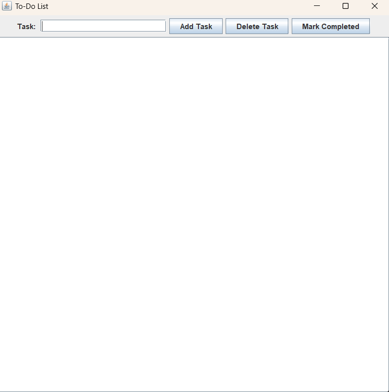

# To-Do-List
A console based task management application to add, remove, and mark tasks as completed.

Rendered into a usable GUI through Java's built in Swing and AWT package.

Used collections (ArrayList) for efficient task management.

Applied OOP principles to structure the app with separate classes.

Visual: 

